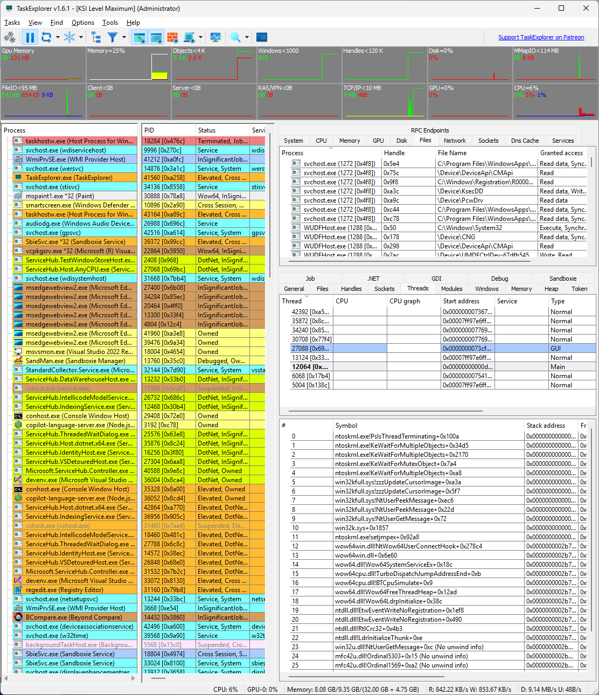
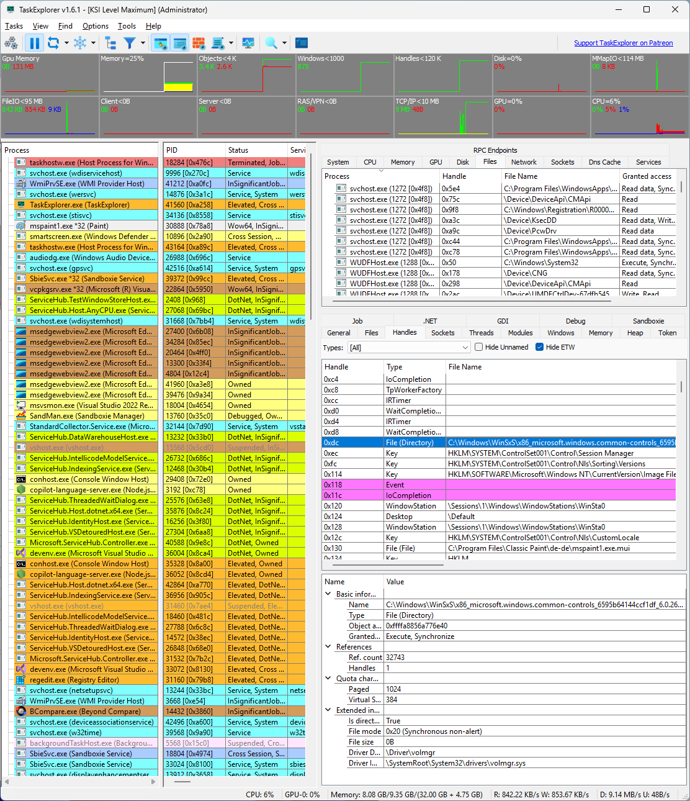
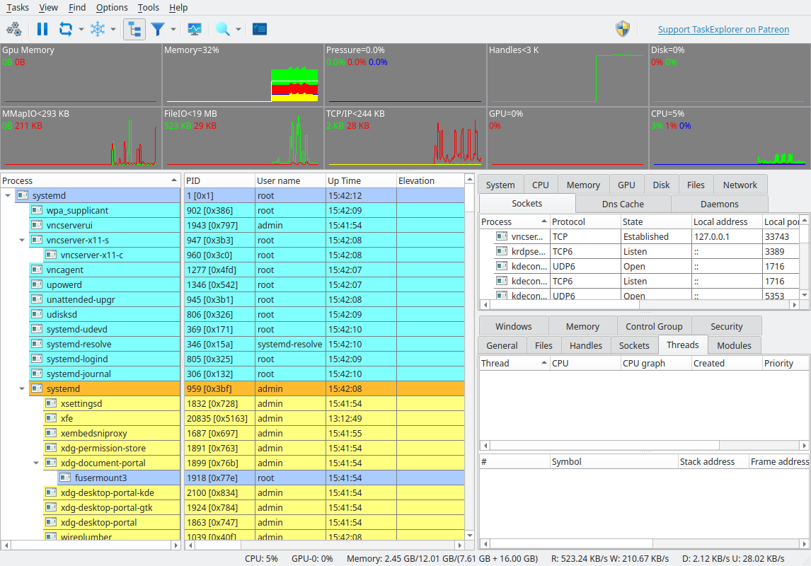

# TaskExplorer

Task Explorer is a powerful task management tool designed not only to monitor running applications but to provide deep insight into what those applications are doing. Its user interface prioritizes speed and efficiency, delivering real-time data on processes with minimal interaction. Instead of requiring multiple windows or sub-windows, Task Explorer displays relevant information in accessible panels. When selecting a process, detailed information is displayed in the lower half of the screen, allowing you to navigate through the data seamlessly using the arrow keys. The dynamic data refresh allows users to observe changes in real-time, offering additional clarity and insight into system performance and behavior.

Task Explorer runs on **Windows and Linux**, on x86-64 and ARM64.

## Features

Task Explorer offers an array of advanced features to provide comprehensive visibility into the system. The **Thread Panel** displays a stack trace for the selected thread, offering immediate insights into the current actions of an application, which is particularly useful for diagnosing deadlocks or performance bottlenecks. The **Memory Panel** allows users to view and edit process memory, featuring an advanced memory editor with string search capabilities. In the **Handles Panel**, all open handles are displayed, including essential details such as file names, current file positions, and sizes, giving a clear view of the disk operations a program is performing. 

The **Socket Panel** provides visibility into all open connections or sockets for each process, with additional data rate information. It also has the option to show pseudo UDP connections based on ETW data, allowing users to monitor network communications effectively. The **Modules Panel** lists all loaded DLLs and memory-mapped files, with the ability to unload or inject DLLs as needed. Additionally, the application includes a variety of other useful panels, including **Token**, **Environment**, **Windows**, **GDI**, and **.NET** panels.

By double-clicking a process, you can open the **Task Info Panels** in a separate window, enabling the simultaneous inspection of multiple processes. The system monitoring capabilities are robust as well, featuring toolbar graphs that show real-time usage of system resources such as CPU, handles, network traffic, and disk access. The **System Info Panels** display all open files and sockets and allow users to control system services, including drivers. Dedicated performance panels for CPU, Memory, Disk I/O, Network, and GPU resources offer detailed graphs, making it easy to monitor and optimize system performance.

For users who need more screen space, the **System Info Panel** can be fully collapsed or opened in a separate window, maximizing the available area for the task panels.

## Screen Shots




The same application on Linux. The **Pressure** graph, the **Daemons** tab and the **Control Group** and **Security** panels have no Windows counterpart, and the process tree follows the systemd hierarchy:



## Linux

The Linux port is a native backend, not a compatibility layer: processes, threads, open files, modules, memory maps and windows come from `/proc`, sockets from `sock_diag` netlink, services from systemd over D-Bus, and thread stack traces are unwound with libdwfl from elfutils, complete with symbol offsets and `file:line` where debug information is available.

Two process panels have no Windows counterpart and appear only here:

- **Control Group** — the unified cgroup this process belongs to, with its cpu, memory, io and pids accounting and limits
- **Security** — the LSM profile (AppArmor or SELinux), seccomp mode and filter count, capability sets, and the no-new-privs flag

The toolbar gains a **Pressure (PSI)** graph, the share of time work was stalled waiting for cpu, memory or io — a figure Linux exposes and Windows has nothing like. Alongside those, the **Services** panel is presented as **Daemons** and drives systemd units, the process tree understands containers and sandboxes, and **Create Crash Dump** writes a real ELF core file — the same format the kernel and `gcore` produce, openable with `gdb <executable> <core>`.

Some things a task manager can show on Windows simply do not exist on Linux, and their panels are compiled out rather than left blank: **Token**, **Job**, **GDI**, **.NET**, **RPC**, **Pool** and **Atom** are Windows kernel concepts. The **Heap** panel is empty because glibc publishes no enumerable arenas to an outside observer, and UDP sockets carry no transfer rates because the kernel keeps no `tcp_info` equivalent for them.

### Privileged operations

Task Explorer runs unprivileged. Reading another user's I/O counters, open files or memory — and stopping a process to write its core dump — needs privileges that a task manager should not hold all the time, so those are delegated to a small helper process started on demand under **Tasks → Use Privileged Helper**. It is off by default, because switching it on raises an authentication prompt, and a task manager should not do that merely because it was started. **Restart Elevated** remains available for a fully privileged session.

### Wayland

Under a Wayland session Task Explorer runs through XWayland and works normally, with one exception: the **Windows** panel is empty, because Wayland deliberately provides no way for one client to enumerate another client's windows. Everything else is unaffected.

## System Requirements

**Windows** — Windows 7 or higher, on both 32-bit and 64-bit systems.

**Linux** — glibc 2.35 or newer, and an X11 or XWayland session. The published builds are made on Ubuntu 22.04 for both x86-64 and ARM64, which covers Ubuntu 22.04, Debian 12, Raspberry Pi OS Bookworm, Fedora 36 and later releases of each. The ARM64 build is tested on a Raspberry Pi 4.

Qt and the other libraries that cannot be relied upon are shipped alongside the executable and found relative to it, so the archive is self-contained: unpack it anywhere and run it, with no installation, no wrapper script and no `LD_LIBRARY_PATH`. Optional integrations degrade rather than fail — without systemd the Daemons panel is empty, without systemd-resolved the DNS cache is.

## Building

Both platforms build from the same CMake description and need Qt 6.5 or newer.

```sh
cmake -S . -B build -G Ninja -DCMAKE_BUILD_TYPE=Release
cmake --build build
```

On Linux the build also assembles the self-contained output directory described above. `Installer/README-portable.md` covers how that works and, importantly, why the minimum glibc is decided by the machine the build runs on rather than by what gets bundled. `LINUX_TESTING.md` records what has been verified, what is empty by design, and what is still outstanding.

## Additional Information

Task Explorer is built using the Qt Framework. On Windows it leverages the Process Hacker library and uses a custom-compiled version of the systeminformer.sys driver from the [SystemInformer](https://github.com/winsiderss/systeminformer/) project, ensuring robust performance and system monitoring capabilities. On Linux it needs no kernel module at all, reading everything the kernel already exposes through `/proc`, `/sys`, netlink and D-Bus.

## Support

If you find Task Explorer useful, please consider supporting the project on Patreon: [https://www.patreon.com/DavidXanatos](https://www.patreon.com/DavidXanatos)

Icons provided by [Icons8](http://icons8.com/).
